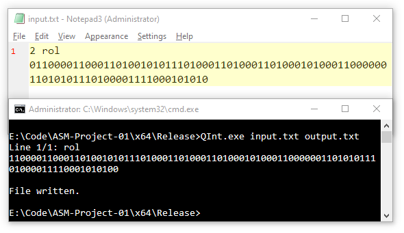

# Về báo cáo

**Đồ án 1: "Biểu diễn và tính toán số nguyên lớn"**
Môn `CSC10005`: Kiến trúc máy tính và hợp ngữ
Khoa CNTT – CTĐA, Trường ĐH KHTN – ĐHQG TP.HCM
`2019-11-08 ~ 2019-11-30`

Nhóm gồm 2 thành viên (thuộc lớp `18CLC6`):

-   `18127221`: Bùi Văn Thiện (GitHub: [@84436](https://github.com/84436))
-   `18127231`: Đoàn Đình Toàn (GitHub: [@t3bol90](https://github.com/t3bol90))

---

# Về đồ án (`QInt`)

| Công việc                           | Thành viên thực hiện |
| ----------------------------------- | :------------------: |
| Thiết lập đồ án (GitHub repo, v.v.) |      Văn Thiện       |
| Test và sửa lỗi chung*              |      Đình Toàn       |
| Viết báo cáo                        | Đình Toàn, Văn Thiện |

\* sau khi đồ án đã hoàn thiện giai đoạn đầu

### Tổng quan

-   Mức độ hoàn thiện: 100%; đã pass 100 test cases cơ bản được đính kèm theo yêu cầu đồ án.
-   Môi trường lập trình: Microsoft Visual Studio 2019 trên Windows 10 + JetBrains CLion 2019.2 trên Ubuntu 18.04.3 LTS

### Ý tưởng thiết kế

-   Khi bắt đầu đồ án, nhóm đã gặp một số trở ngại trong việc tìm giải pháp lưu trữ:

    -   C/C++ không hỗ trợ sẵn các kiểu primitive `int` có kích thước lớn hơn 64-bit.
    -   Một số giải pháp như `__int128_t` trong GCC, hay `boost::integer` không có sẵn trong *mọi* môi trường lập trình C/C++ (và việc sử dụng những giải pháp này cũng không được cho phép trong phạm vị đồ án.)
    -   Việc nhóm các biến dữ liệu nhỏ hơn (như 2 biến `int64_t`, 4 biến `int32_t` hay 8 biến `int16_t`) gây trở ngại trong vấn đề truy cập ngẫu nhiên, xử lý hàng loạt các bit và quá trình gỡ lỗi nói chung.
    -   Mảng `bool[128]` là một lựa chọn khá tốt (có thể truy cập ngẫu nhiên từng bit) nhưng không tối ưu về mặt bộ nhớ (mỗi một số khi đó cần 128 bytes để lưu trữ.)

    Tuy nhiên, sau một thời gian, nhóm cuối cùng đã tìm ra được giải pháp lưu trữ tối ưu:
    **`std::bitset`, có sẵn trong thư viện chuẩn của C++**

- `std::bitset` có thể được coi như một mảng các `bool`, nhưng…

    -   mỗi phần tử được lưu trong 1 bit thay vì 1 byte (sử dụng bộ nhớ tối ưu)
    -   có thể truy cập ngẫu nhiên các phần tử
    -   có sẵn một số phép toán logic cơ bản (phần lớn có thể tận dụng được, ngoại trừ `operator>>` được nói sau trong phần **Chức năng**)

-   Đối với việc xử lý các hệ cơ số khác nhau (cụ thể là 2/10/16), việc tính toán sẽ chỉ được thực hiện trên hệ 2; nói cách khác, hệ 10 và 16 chỉ là hai cách biểu diễn khác nhau của một số hệ 2, nên việc chuyển đổi và biểu diễn chỉ tập trung vào hệ $2 \leftrightarrow 10$ và $2 \leftrightarrow 16$.

-   Phạm vi biểu diễn của `QInt` sử dụng `bitset` nói trên (trong hệ 10): $-2^{127}$ tới $2^{127}-1$

### Các nguồn tham khảo

-   [`std::bitset` trên CPlusPlus.com](http://www.cplusplus.com/reference/bitset/bitset/)
-   Dan Vanderkam, [Arbitrary Precision Hex <-> Dec converter in JavaScript](https://www.danvk.org/hex2dec.html)
-   Ernst W. Mayer (2016), "Efficient long division via Montgomery multiply", phiên bản 6 ([arXiv:1303.0328v6 [cs.DS]](https://arxiv.org/abs/1303.0328v6)).
    Có sẵn file đính kèm với báo cáo (`1303.0328.pdf`).

---

# Chức năng

| Chức năng                                                    | Thành viên cài đặt |   Đã hoàn thiện    |
| ------------------------------------------------------------ | :----------------: | :----------------: |
| Đọc/ghi file                                                 |     Văn Thiện      | :heavy_check_mark: |
| Chuyển đổi base (2 $\rightarrow$ 10, 2 $\leftrightarrow$ 16) |     Văn Thiện      | :heavy_check_mark: |
| Chuyển đổi base (10 $\rightarrow$ 2)                         |     Đình Toàn      | :heavy_check_mark: |
| `operator~` (NOT)                                            |     Văn Thiện      | :heavy_check_mark: |
| `rol()` (Xoay trái 1bit)                                     |     Văn Thiện      | :heavy_check_mark: |
| `ror()` (Xoay phải 1bit)                                     |     Văn Thiện      | :heavy_check_mark: |
| `operator&` (AND)                                            |     Văn Thiện      | :heavy_check_mark: |
| `operator|` (OR)                                             |     Văn Thiện      | :heavy_check_mark: |
| `operator^` (XOR)                                            |     Văn Thiện      | :heavy_check_mark: |
| `operator<<` (Shift trái)                                    |     Văn Thiện      | :heavy_check_mark: |
| `operator>>` (Shift phải số học)                             |     Đình Toàn      | :heavy_check_mark: |
| `operator+` (Phép cộng)                                      |     Văn Thiện      | :heavy_check_mark: |
| `operator-` (Phép trừ)                                       |     Văn Thiện      | :heavy_check_mark: |
| `operator*` (Phép nhân)                                      |     Đình Toàn      | :heavy_check_mark: |
| `operator/` (Phép chia)                                      |     Đình Toàn      | :heavy_check_mark: |

---

### Chuyển đổi cơ số

Việc chuyển đổi giữa các hệ cơ số được cài đặt trong constructor của `QInt` (chuyển từ string số hệ 2/10/16 sang biểu diễn nhị phân trong phần private của `QInt`, tức bitset) và hàm chuyển `toString` (chuyển từ bitset sang string số hệ 2/10/16.)

##### base2 $\rightarrow$ base10

|          |
| :---------------------------------------: |
| Chuyển đổi cơ số (base2 $\rightarrow$ 10) |

Mỗi bit trong bitset sẽ có giá trị tương ứng trong hệ 10 là $2^k$, với $k = [0, 127]$.

Kiểu primitive int lớn nhất có thể có trong C(++) là 64-bit, nên việc tính toán và cộng dồn thông thường sẽ gây tràn số. Khi đó, để tính $2^k$ mà không gây tràn số/không bị giới hạn trong khoảng $2^{64}$, một "bảng $2^k$" sẽ được sử dụng. Bảng này…

-   được cài đặt dưới dạng tương tự mô hình singleton: bảng sẽ được lập ra và tính ngay trong lần đầu tiên một object `QInt` được khởi tạo, và sẽ tiếp tục tồn tại trong bộ nhớ cho đến khi kết thúc vòng đời chương trình (cách cài đặt này sẽ tiết kiệm được chi phí tính toán hơn việc tính $2^k$ riêng lẻ mỗi lần với $k$ bất kì);
-   gồm 128 mảng, tương ứng với 128 giá trị $2^k$ cần tính;
-   mỗi mảng gồm $\lceil \log_{10}(2^{128}) \rceil = 39$ phần tử, tương ứng với 39 chữ số (số chữ số của $2^{128}$), được ghi theo thứ tự trái-qua-phải (hàng đơn vị nằm ở đầu mảng);
-   có mảng đầu tiên chứa $2^0 = 1$, và các mảng tiếp theo sẽ bằng 2 lần giá trị từng phần tử của mảng trước đó; 
-   mỗi phần tử trong mảng nếu trong quá trình nhân 2 lên có giá trị lớn hơn 9 sẽ được lấy phần dư cộng dồn qua phần tử kế tiếp.

Khi đã có "bảng $2^k$", việc chuyển bitset thành số hệ 10 bây giờ chỉ còn là việc cộng dồn các giá trị $2^k$ với $k$ tương ứng các bit `1` (duyệt qua bitset từ bit thấp nhất lên), ghi ngược lại từng chữ số trong mảng thành một string, và loại bỏ đi các số 0 thừa ở đầu.

##### base10 $\leftarrow$ base2

|              |
| :-------------------------------------------: |
| Chuyển đổi cơ số (base10 $\rightarrow$ base2) |

Về cơ bản, việc đọc từ base10 và chuyển sang base2 nếu theo logic bình thường thì cần hai method là chia cho hai sau đó kiểm tra tính chẵn lẻ của thương.

-   Cài đặt hàm chia cho hai đối với string, `divByTwo()` và hàm kiểm tra tính chẵn lẻ của một string, `isOdd()`.
-   Với mỗi lần chia, ta rút trích được trạng thái bit hiện tại của số và lưu vào bitset của `QInt`.

##### base2 $\leftrightarrow$ base16

|              |              |
| :-------------------------------------------: | :-------------------------------------------: |
| Chuyển đổi cơ số (base2 $\rightarrow$ base16) | Chuyển đổi cơ số (base16 $\rightarrow$ base2) |

Mỗi 4 bit trong bitset sẽ tương ứng với 1 số trong hệ 16, nên việc chuyển đổi qua lại giữa 2 hệ này tương đối dễ dàng. Một mảng hằng `HEX[]` được định nghĩa sẵn, gồm 16 chữ số thập lục phân sắp xếp từ `0` đến `F`, để hỗ trợ cho việc chuyển đổi.

Đối với base2 $\rightarrow$ base16:

-   Duyệt qua bitset từ bit thấp nhất lên, lấy từng nhóm 4 bit mỗi lần
-   Tính giá trị của 4 bit đó ở hệ 10, sau đó tra ngược trong `HEX` để lấy kí tự tương ứng
-   Chèn kí tự đã lấy vào đầu string, và loại bỏ các số 0 thừa ở đầu một khi đã duyệt xong bitset.

Đối với base16 $\rightarrow$ base2:

-   Duyệt qua chuỗi số từ hàng đơn vị lên, lấy từng chữ số một ra
-   Tra ngược chữ số đó trong `HEX` để lấy giá trị trong hệ 10 tương ứng, sau đó chia lấy dư với 2 4 lần liên tiếp.
-   Ghi từng bit một vào bitset. Khi cần xuất ra string, loại bỏ các số 0 thừa ở đầu.

##### base10 $\leftrightarrow$ base16

|             |             |
| :--------------------------------------------: | :--------------------------------------------: |
| Chuyển đổi cơ số (base10 $\rightarrow$ base16) | Chuyển đổi cơ số (base16 $\rightarrow$ base10) |

Vì đã có sẳn hàm để chuyển đổi từ hệ 2 sang 10/16, nên cách tiện nhất để chuyển đổi giữa hệ 10 và 16 là thông qua hệ 2 làm trung gian.

---

### Toán tử logic

Ngoại trừ những toán tử được mô tả bên dưới, các toán tử còn lại (`~`, `&`, `|`, `^` và `<<`) được thực hiện bởi các toán tử tương ứng có sẵn trong `std::bitset`.

|  |  |
| :---------------------------: | :---------------------------: |
|        Phép `~` (NOT)         |        Phép `^` (XOR)         |

|  |  |
| :---------------------------: | :-------------------------: |
|        Phép `&` (AND)         |        Phép `|` (OR)        |

|  |
| :---------------------------: |
|    Phép `<<` (Shift trái)     |

##### `rol()`/`ror()` (Xoay trái/Xoay phải 1bit)

|  |  |
| :---------------------------: | :---------------------------: |
|  Phép `rol` (xoay trái 1bit)  |  Phép `ror` (xoay phải 1bit)  |

Việc xoay bit cơ bản là đánh dấu bit cao nhất (đối với `ror()`) / bit thấp nhất (đối với `rol()`), shift bitset hiện tại theo hướng ngược lại hướng đang xoay, và điền lại bit thấp nhất (đối với `ror()`) / bit cao nhất (đối với `rol()`).

##### `operator>>` (Shift phải số học)

|  |
| :---------------------------: |
| Phép `>>` (Shift phải số học) |

Vì `operator>>` có sẵn trong `std::bitset` là phép shift phải logic nên cần phải xử lý thủ công việc điền các "lỗ trống" có được sau khi shift với bit cao nhất (MSB) thay vì bit `0` trước khi shift. Giải pháp được cài đặt:

-   Tạo một bitset với các bit cao cần điền với MSB đã được đánh dấu. Gọi bitset này là mask.
-   Xem đối tượng `QInt` cần shift là một vòng bit, kết quả trả về khi shift là cắt vòng bit này trong đoạn từ $QLEN - 1$ cho đến $k$, với $k$ là số bit cần shift.
-   Chép đè đoạn vừa cắt vào bitset vừa tạo.

---

### Toán tử số học

##### `operator+` (Phép cộng)

|  |
| :---------------------------: |
|        Phép cộng (`+`)        |

Phép cộng này sẽ duyệt qua bitset của số gốc và số cần cộng, và sau đó thực hiện phép cộng trên từng bit một (kèm với bit nhớ.) Cách cài đặt phép cộng bit trong đây được dựa trên các "luật cộng bit" suy ra từ 8 trạng thái có thể của 3 bit: bit gốc, bit được cộng vào và bit nhớ:

| Bit gốc | Bit được cộng | Bit nhớ | Hành động              |
| ------- | ------------- | ------- | ---------------------- |
| 0       | 0             | 0       | Ghi 0                  |
| 0       | 1             | 0       | Ghi 1                  |
| 1       | 0             | 0       | Ghi 1                  |
| 1       | 1             | 0       | Ghi 0, nhớ 1           |
| 0       | 0             | 1       | Ghi 1, đặt lại bit nhớ |
| 0       | 1             | 1       | Ghi 0, nhớ 1           |
| 1       | 0             | 1       | Ghi 0, nhớ 1           |
| 1       | 1             | 1       | Ghi 1, nhớ 1           |

##### `operator-` (Phép trừ)

|  |
| :---------------------------: |
|        Phép trừ (`-`)         |

Bản chất phép trừ một số là phép cộng với bù 2 của số đó, nên toán tử này tận dụng được `operator+` và `operator~` đã được cài đặt trước đó.

##### `operator*` (Phép nhân)

|  |
| :-----------------------------: |
|         Phép nhân (`*`)         |

Đầu tiên ta mặc định là nhân hai số dương, biến đổi các số thành số dương bằng hàm `q_abs()`. Sau đó đánh dấu trạng thái cùng dấu hay khác dấu của hai số.
Ta chọn ra chuỗi bit nhỏ hơn làm multiplicand. Kết hợp phép shift và biến đếm, với mỗi bit của multiplicand: nếu bit đó là 1 thì shift số còn lại và cộng vào kết quả.

Kết quả trả về sẽ được thêm dấu nhờ vào đánh dấu đã gắn trước đó.

>   Trước khi quyết định thực hiện ý tưởng này, nhóm đã mất 3 ngày vật lộn với FFT để cài đặt một phép nhân nhanh hơn. Tuy nhiên, FFT làm việc với số thực nên bị sai số nhỏ khi thực hiện phép nhân, vì thế nhóm quay về phương án an toàn hơn là dùng shift. Nếu như có thể tác động trực tiếp đến tầng thấp hơn trong quá trình tính toán thì thuật toán FFT nói trễn trên sẽ chạy nhanh hơn rất nhiều so với cài đặt hiện tại.

##### `operator/` (Phép chia)

|  |
| :---------------------------: |
|        Phép chia (`/`)        |
Tương tự như phép nhân, ta mặc định là nhân hai số dương, biến đổi các số thành số dương bằng hàm `q_abs()`. Sau đó đánh dấu trạng thái cùng dấu hay khác dấu của hai số.
Kết hợp phép shift và phép trừ, ta thực hiện tuần tự sẽ ra được kết quả.

Kết quả trả về sẽ được thêm dấu nhờ vào đánh dấu đã gắn trước đó.

>   Một lần nữa, nhóm dự định cài đặt một phép chia nhanh hơn, cụ thể là Newton-Raphson, để cải thiện thời gian thực thi. Tuy nhiên, vì thuật toán trên độ chính xác không cao (chỉ có thể tính xấp xỉ), nên nhóm đã quyết định quay về phương án an toàn. 

### Lời cảm ơn
Để hoàn thiện được đồ án này, không thể nhắc tới sự hướng dẫn từ những thầy cô ở HCMUS. Gửi lời cảm ơn chân thành đến thầy Lê Quốc Hòa - giảng viên phụ trách bộ môn Kiến Trúc Máy Tính và Hợp Ngữ, cô Chung Thùy Linh - giảng viên hướng dẫn thực hành và là người trực tiếp hướng dẫn đồ án.

Một lời cảm ơn nữa đến những người đồng đội đã cùng nhau thực hiện và hoàn thiện đồ án này cho tới thời điểm cuối cùng.

> Chúc mọi người có nhiều sức khỏe và thành công trong công việc.

